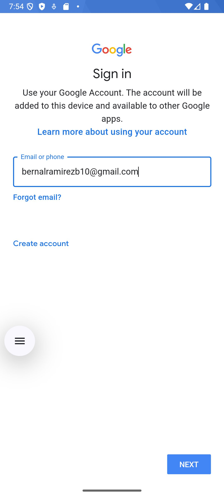
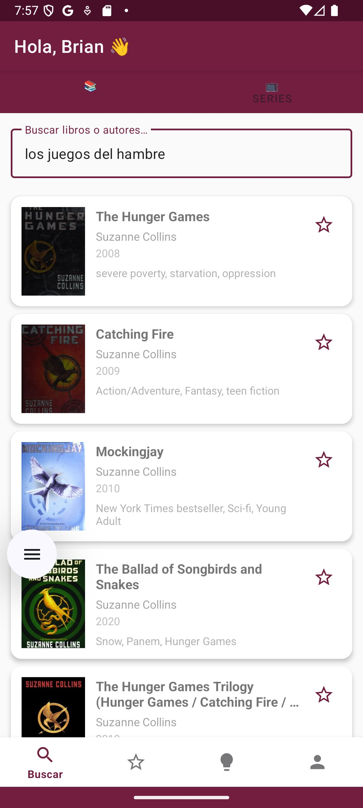
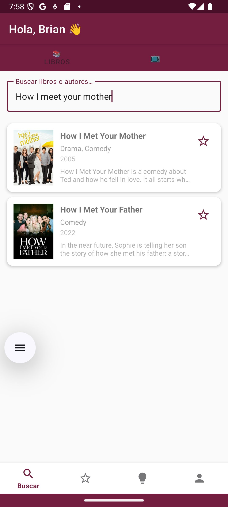
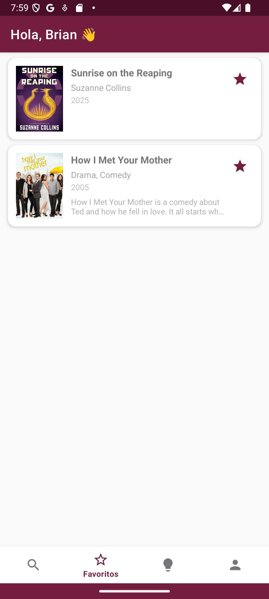
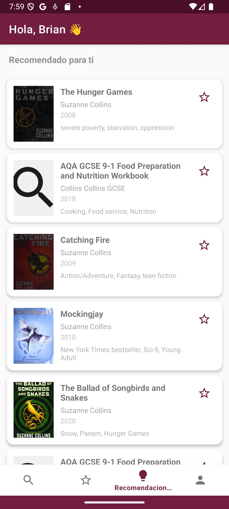
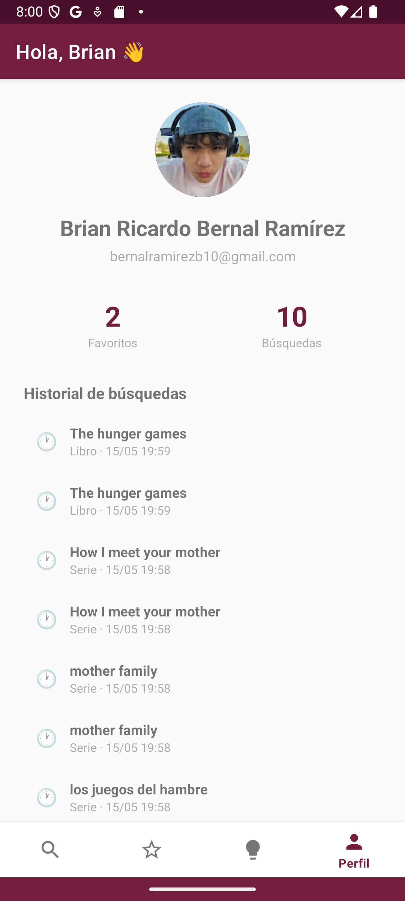

# Práctica 5 — Consulta de Base de Datos vía APIs y Funcionalidades Específicas

| Campo | Datos |
|---|---|
| **Integrantes** | Bernal Ramírez Brian Ricardo / Saavedra Mata Karla Sofía |
| **Boletas** | 2023630387 / 2019300048 |
| **Asignatura** | Desarrollo de Aplicaciones Móviles Nativas |
| **Profesor** | Gabriel Hurtado Avilés |
| **Fecha de entrega** | 15 de mayo de 2026 |
| **Institución** | Instituto Politécnico Nacional — Escuela Superior de Cómputo |

---

## Introducción

Esta práctica desarrolla una aplicación Android nativa en Kotlin que integra consultas a APIs públicas (Open Library y TVMaze), autenticación con Google Sign-In via Firebase, persistencia local con Room y un sistema de recomendaciones personalizadas basado en favoritos e historial del usuario.

La aplicación funciona tanto con conexión a internet como en modo offline, mostrando datos cacheados localmente cuando no hay red disponible.

---

## Instalación

```bash
git clone https://github.com/zahirobrian/practica5.git
```

1. Abre Android Studio → **Open** → selecciona `Practica5App/`
2. Configura **JDK 17** en `File → Settings → Build → Gradle → Gradle JDK`
3. Espera el Gradle Sync
4. **Run 'app'**

> El archivo `google-services.json` ya está incluido en el repo.

---

## Arquitectura

```
MVVM + Repository Pattern
├── View         → Activities + Fragments + Adapters
├── ViewModel    → SearchViewModel, FavoritesViewModel, RecommendationsViewModel
├── Repository   → MediaRepository (coordina API y Room)
└── Model
    ├── Remote   → Retrofit (OpenLibraryApi, TVMazeApi)
    └── Local    → Room (MediaItem, SearchHistory)
```

---

## Ejercicio 1: Integración con API REST y Persistencia

### Conexión a APIs con Retrofit

```kotlin
// Open Library
Retrofit.Builder()
    .baseUrl("https://openlibrary.org/")
    .addConverterFactory(GsonConverterFactory.create())
    .build()
    .create(OpenLibraryApi::class.java)

// TVMaze
Retrofit.Builder()
    .baseUrl("https://api.tvmaze.com/")
    .addConverterFactory(GsonConverterFactory.create())
    .build()
    .create(TVMazeApi::class.java)
```

### Estrategia de sincronización (online/offline)

```kotlin
return if (isOnline()) {
    // Con red: consulta API → guarda en Room → devuelve resultados
    val response = RetrofitClient.openLibraryApi.searchBooks(query)
    val items = response.docs.map { it.toMediaItem() }
    mediaDao.insertAll(items)  // sincronización local
    items
} else {
    // Sin red: devuelve caché de Room (modo offline)
    mediaDao.getCachedSearch(query, "book")
}
```

### Persistencia de sesión

Firebase Auth mantiene la sesión activa automáticamente. Al iniciar la app se verifica:

```kotlin
if (auth.currentUser != null) {
    goToMain()  // sesión activa, va directo al main
    return
}
```

---

## Ejercicio 2: Consumo de APIs Públicas

### Open Library API
- **Endpoint:** `https://openlibrary.org/search.json?q={query}`
- **Búsqueda:** por título, autor o tema
- **Campos:** título, autor, año, portada (cover_i → URL de imagen)

### TVMaze API
- **Endpoint:** `https://api.tvmaze.com/search/shows?q={query}`
- **Búsqueda:** por nombre de serie
- **Campos:** nombre, géneros, año, estado, imagen, resumen

### Google Sign-In (obligatorio)

```kotlin
val gso = GoogleSignInOptions.Builder(GoogleSignInOptions.DEFAULT_SIGN_IN)
    .requestIdToken(getString(R.string.default_web_client_id))
    .requestEmail()
    .build()

// Autenticación con Firebase
val credential = GoogleAuthProvider.getCredential(idToken, null)
auth.signInWithCredential(credential)
    .addOnSuccessListener { goToMain() }
```

---

## Ejercicio 3: Búsqueda, Favoritos y Recomendaciones

### Sistema de favoritos (Room)

```kotlin
@Entity(tableName = "media_items")
data class MediaItem(
    @PrimaryKey val id: String,
    val title: String,
    val subtitle: String,
    val isFavorite: Boolean = false,
    ...
)

// Toggle favorito
suspend fun toggleFavorite(item: MediaItem) {
    val existing = mediaDao.getById(item.id)
    if (existing == null) mediaDao.insert(item.copy(isFavorite = true))
    else mediaDao.updateFavorite(item.id, !existing.isFavorite)
}
```

### Sistema de recomendaciones

Las recomendaciones se generan en base a:
1. **Favoritos de libros** → busca más libros del mismo autor en Open Library
2. **Favoritos de series** → busca más series del mismo género en TVMaze
3. **Historial de búsquedas** → si no hay favoritos, usa la búsqueda más reciente

```kotlin
// Basado en favoritos de libros
val bookFavs = mediaDao.getFavoritesByType("book")
val author = bookFavs.firstOrNull()?.subtitle ?: ""
val resp = RetrofitClient.openLibraryApi.searchByAuthor(author, 6)
```

### Historial de búsquedas (Room)

```kotlin
@Entity(tableName = "search_history")
data class SearchHistory(
    val userId: String,
    val query: String,
    val type: String,
    val timestamp: Long = System.currentTimeMillis()
)
```

---

## Dependencias principales

| Librería | Versión | Uso |
|---|---|---|
| Retrofit | 2.9.0 | Cliente HTTP para APIs |
| OkHttp | 4.12.0 | Logging y timeouts |
| Room | 2.6.1 | Base de datos local |
| Firebase Auth | BOM 32.7.0 | Autenticación |
| Google Sign-In | 21.0.0 | Login con Google |
| Glide | 4.16.0 | Carga de imágenes/portadas |
| Navigation Component | 2.7.6 | Navegación entre fragments |

---

## Pruebas realizadas

| Dispositivo / Emulador | API | Resultado |
|---|---|---|
| Medium Phone API 36 (Emulador) | 36 | ✅ Funcional |
| Pixel 7 (Emulador) | 33 | ✅ Funcional |
| Sin conexión (modo avión) | — | ✅ Datos cacheados visibles |

---

## Conclusiones

- Firebase Auth con Google Sign-In simplifica enormemente la gestión de identidad de usuarios, eliminando la necesidad de implementar un backend propio de autenticación.
- Retrofit con OkHttp es la combinación estándar para consumo de APIs en Android; el logging interceptor facilita el debugging de llamadas HTTP.
- La estrategia online-first con fallback a Room permite que la app funcione sin conexión sin código adicional complejo.
- Room con LiveData hace que la UI se actualice automáticamente ante cambios en favoritos o historial, sin necesidad de refrescar manualmente.
- El sistema de recomendaciones basado en favoritos e historial es simple pero efectivo para personalizar la experiencia del usuario.

---

## Bibliografía

- Android Developers. (2024). *Room persistence library*. https://developer.android.com/training/data-storage/room
- Android Developers. (2024). *Retrofit*. https://square.github.io/retrofit/
- Firebase. (2024). *Firebase Authentication*. https://firebase.google.com/docs/auth/android/google-signin
- Open Library. (2024). *Open Library API*. https://openlibrary.org/developers/api
- TVMaze. (2024). *TVMaze API*. https://www.tvmaze.com/api
- Android Developers. (2024). *Navigation component*. https://developer.android.com/guide/navigation

---

## Desarrollo — Capturas de pantalla

### Login con Google

La pantalla de inicio muestra el botón de Google Sign-In sobre fondo guinda institucional. Al presionarlo se abre el flujo estándar de autenticación de Google con Firebase.

<p align="center">
  
  &nbsp;&nbsp;&nbsp;
  
</p>
<p align="center"><i>Figura 1. Pantalla de login — Figura 2. Flujo de autenticación con Google</i></p>

---

### Búsqueda de Libros (Open Library API)

La pestaña 📚 Libros consume la Open Library API via Retrofit. Al buscar "los juegos del hambre" devuelve resultados con portada, autor, año y temas, todos cacheados en Room para acceso offline.

<p align="center">
  
</p>
<p align="center"><i>Figura 3. Búsqueda de libros — "los juegos del hambre" con portadas, autores y temas desde Open Library</i></p>

---

### Búsqueda de Series (TVMaze API)

La pestaña 📺 Series consume la TVMaze API. Al buscar "How I meet your mother" devuelve resultados con imagen, géneros, año de estreno y sinopsis.

<p align="center">
  
</p>
<p align="center"><i>Figura 4. Búsqueda de series — "How I meet your mother" con datos de TVMaze API</i></p>

---

### Favoritos

Los ítems marcados con ⭐ se guardan en Room Database y son visibles sin conexión. La lista muestra libros y series mezclados con su portada, autor/género y año.

<p align="center">
  
</p>
<p align="center"><i>Figura 5. Pantalla de favoritos — "Sunrise on the Reaping" (libro) y "How I Met Your Mother" (serie) guardados en Room</i></p>

---

### Recomendaciones Personalizadas

El sistema genera recomendaciones basadas en los favoritos del usuario. Al tener un libro de Suzanne Collins como favorito, recomienda más libros de la misma autora vía Open Library.

<p align="center">
  
</p>
<p align="center"><i>Figura 6. Recomendaciones generadas automáticamente basadas en favoritos del usuario</i></p>

---

### Perfil de Usuario

La pantalla de perfil muestra la foto, nombre completo y correo de la cuenta de Google. También muestra contadores de favoritos y búsquedas, historial completo con fechas, y opción de cerrar sesión.

<p align="center">
  
</p>
<p align="center"><i>Figura 7. Perfil — Brian Ricardo Bernal Ramírez, 2 favoritos, 10 búsquedas, historial con timestamps</i></p>
